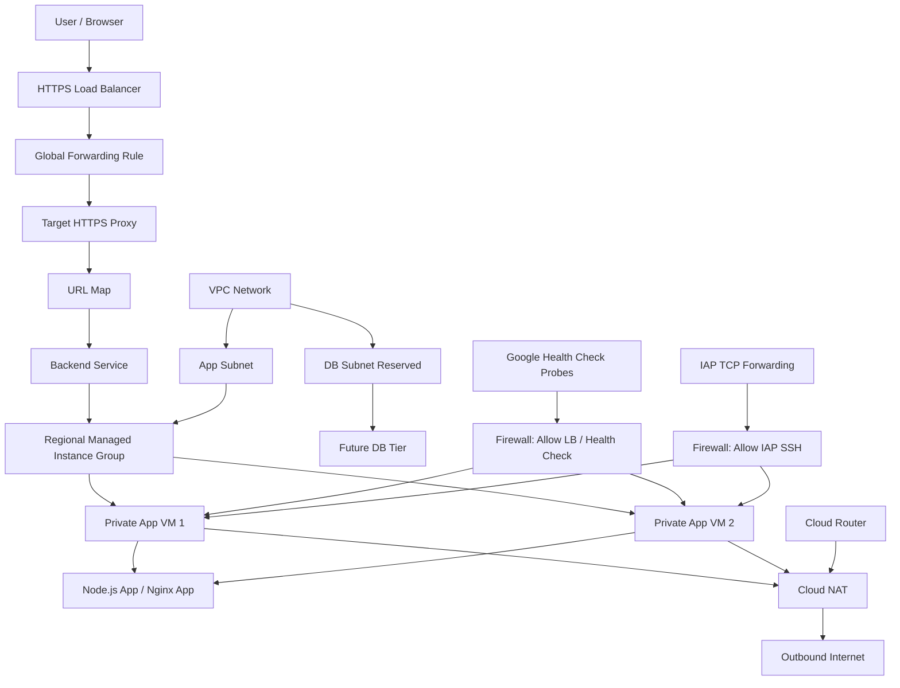

# Terraform GCP Production-Lite Web Platform

A production lite google cloud web platform project for showcasing that I can code terraform.

This project provisions a small but production-shaped application infrastructure on Google Cloud. It uses:

1. Private backend virtual machines inside a Managed Instance Group,
2. Outbound internet access through Cloud NAT,
3. An external HTTP(S) Load Balancer,
4. Google-managed HTTPS certificates,
5. Optional Cloud Armor backend security policy,
6. Health checks,
7. Firewall rules,
8. Service accounts, and
9. Remote Terraform state

The goal of this repository is not to build a full enterprise landing zone. The goal is to demonstrate that application infrastructure can be created in a clean, modular, repeatable, and operationally understandable way using Terraform.

# Project Status

Current version:

> V1.2: Security Hardening

## V1.1 - HTTPS and Custom Domain

This version adds HTTPS support using a Google-managed SSL certificate

The load balancer now supports:

- HTTPS on port 443
- Custom Domain
- Google-managed SSL Certificate
- Optional HTTP to HTTPS redirect

The backend architecture remains the same:

- Private backend VMs
- Regional MIG
- Cloud NAT
- Backend Service
- Health Checks

## V1.2 - Security Hardening

This version adds an optional Cloud Armor backend security policy to the existing backend service and enables load balancer request logging configuration for policy verification.

The HTTP(S) frontend, URL map, backend service, and regional MIG remain shared. New WAF rules should begin in preview mode and be reviewed in request logs before enforcement.

## Why I created this

My previous Terraform artifacts focused on the foundation layer:

```text
remote state
VPC
subnets
IAM
service accounts
firewall rules
modules
```

This project leviates one layer higher.

For this project, i am not only creating a foundation, but i also created infrastructure that can actually run an application-like workload.

In short:

```text
Artifact 1:
I can create the cloud foundation.

Artifact 2:
I can run a production-shaped web platform on top of that foundation.
```

I hope this artifact can be seen as a portfolio project for cloud engineering, DevOps, and SRE readiness.

## What i am trying to show

I understand how to provision application infrastructure using Terraform, including:

- modular Terraform structure
- remote state with Google Cloud Storage
- custom VPC networking
- map-based subnet creation
- map-based firewall rule creation
- private backend instances
- Cloud NAT for outbound internet access
- application service account
- regional Managed Instance Group
- instance template lifecycle
- startup script bootstrapping
- HTTP health checks
- backend service
- external HTTP Load Balancer
- firewall boundaries
- IAP SSH access pattern
- operational verification
- versioned infrastructure roadmap

## What I Don't include in this version

This version intentionally does not include:

- Cloud SQL
- Secret Manager
- CI/CD
- multi-region deployment
- blue-green deployment
- full observability stack
- Kubernetes
- any other expensive things

## Target Architecture

```text
User
  |
  v
HTTPS Load Balancer on Port 443
  |
  v
Target HTTPS Porxy
  |
  v
Backend Service
  |
  v
Regional Managed Instance Group
  |
  v
Private Application VM(s)
  |
  v
Outbound Internet via Cloud NAT
```

## Architecture Diagram



## Request Flow

User traffic follows this path:

```text
User
-> External HTTP Load Balancer
-> Target HTTP Proxy
-> URL Map
-> Backend Service
-> Regional Managed Instance Group
-> Private application VM
-> Application endpoint
```

The backend VMs do not have external IP addresses.

This means users do not connect directly to the VM instances. All inbound application traffic enters through the load balancer.

## Outbound Flow

The private application VMs still need outbound internet access for tasks such as:

```text
package installation
system updates
calling external services
fetching dependencies during bootstrapping
```

Because the VMs do not have external IP addresses, outbound internet access is provided through Cloud NAT.

```text
Private VM
-> App subnet
-> Cloud NAT
-> Internet
```

In this version, Cloud NAT is intentionally applied only to selected subnets, usually the `app` subnet.

The reserved `db` subnet does not receive outbound internet access by default.

## Health Check Flow

The load balancer uses an HTTP health check to determine whether backend instances are healthy.

```text
Google health check probes
-> firewall rule
-> backend VM
-> /healthz
-> 200 OK
```

The application exposes:

```text
GET /
GET /healthz
GET /metadata
```

The `/healthz` endpoint is used for health checks because it is machine-readable and operationally explicit.

## Application Endpoints

The sample application is intentionally simple.

| Endpoint    | Purpose                          | Expected Response                                 |
| ----------- | -------------------------------- | ------------------------------------------------- |
| `/`         | Root application endpoint        | `Hi from Terraform GCP Production-Lite Platform`  |
| `/healthz`  | Health check endpoint            | `ok`                                              |
| `/metadata` | Instance metadata-style endpoint | JSON with service, environment, version, hostname |

Example `/metadata` response:

```json
{
  "service": "terraform-gcp-production-lite-web-platform",
  "environment": "dev",
  "version": "1.0.0",
  "hostname": "dev-web-mig-xxxx"
}
```

The app is not the focus of this project, but Terraform and infrastructure design are.

## Infrastructure Components

This project provisions:

| Component              | Purpose                                      |
| ---------------------- | -------------------------------------------- |
| VPC                    | Custom network boundary for the platform     |
| App subnet             | Subnet where application VMs run             |
| DB subnet              | Reserved subnet for future database tier     |
| Firewall rules         | Control ingress to private backend instances |
| Cloud Router           | Required for Cloud NAT                       |
| Cloud NAT              | Outbound internet access for private VMs     |
| Service account        | Identity used by application VMs             |
| Instance template      | Defines VM configuration for the MIG         |
| Regional MIG           | Manages application VM instances             |
| HTTP health check      | Checks backend health                        |
| Backend service        | Connects the load balancer to the MIG        |
| URL map                | Routes incoming HTTP requests                |
| Target HTTP proxy      | HTTP proxy frontend                          |
| Global forwarding rule | Public HTTP entry point                      |
| Global IP address      | External IP for the load balancer            |
| GCS backend            | Remote Terraform state storage               |

## Repository Structure

```text
terraform-gcp-production-lite-web-platform/
├── README.md
├── .gitignore
├── versions.tf
├── providers.tf
├── backend.tf.example
├── main.tf
├── variables.tf
├── outputs.tf
├── terraform.tfvars.example
├── locals.tf
├── docs/
│   ├── architecture.md
│   ├── deployment-runbook.md
│   ├── operations-runbook.md
│   ├── verification.md
│   ├── design-decisions.md
│   └── version-roadmap.md
├── scripts/
│   └── startup.sh
└── modules/
    ├── network/
    │   ├── main.tf
    │   ├── variables.tf
    │   └── outputs.tf
    ├── iam/
    │   ├── main.tf
    │   ├── variables.tf
    │   └── outputs.tf
    ├── nat/
    │   ├── main.tf
    │   ├── variables.tf
    │   └── outputs.tf
    ├── compute/
    │   ├── main.tf
    │   ├── variables.tf
    │   └── outputs.tf
    └── load-balancer/
        ├── main.tf
        ├── variables.tf
        └── outputs.tf
```

## Prerequisites

Before running this project, make sure you have:

- Google Cloud project
- Billing enabled
- Terraform installed
- Google Cloud CLI installed
- Remote state bucket already created
- Permissions to create Compute Engine, IAM, networking, and load balancing resources

Recommended local tools:

```text
terraform
gcloud
git
curl
```

Authenticate locally:

```bash
gcloud auth login
gcloud auth application-default login
```

Set your project:

```bash
gcloud config set project YOUR_PROJECT_ID
```

## Required Google Cloud APIs

Enable the required APIs:

```bash
gcloud services enable compute.googleapis.com
gcloud services enable iam.googleapis.com
gcloud services enable cloudresourcemanager.googleapis.com
gcloud services enable logging.googleapis.com
gcloud services enable monitoring.googleapis.com
```

## Remote State Setup

This project expects a GCS bucket for Terraform remote state.

If you already created a remote state bucket in a previous Terraform foundation artifact, reuse it with a separate prefix.

Copy the backend example:

```bash
cp backend.tf.example backend.tf
```

Edit `backend.tf`:

```hcl
terraform {
  backend "gcs" {
    bucket = "YOUR_TERRAFORM_STATE_BUCKET"
    prefix = "terraform-gcp-production-lite-web-platform/v1"
  }
}
```

Example:

```hcl
terraform {
  backend "gcs" {
    bucket = "my-project-terraform-state"
    prefix = "terraform-gcp-production-lite-web-platform/v1"
  }
}
```

Do not commit real backend values if they are specific to your environment.

## Configuration

Copy the example variables file:

```bash
cp terraform.tfvars.example terraform.tfvars
```

Edit:

```hcl
project_id      = "your-gcp-project-id"
admin_principal = "user:your-email@example.com"
```

Example `terraform.tfvars`:

```hcl
project_id      = "your-gcp-project-id"
region          = "asia-southeast2"
environment     = "dev"
name_prefix     = "prod-lite"
admin_principal = "user:your-email@example.com"

network_name = "web-platform-vpc"

subnets = {
  app = {
    cidr_range            = "10.80.1.0/24"
    private_google_access = true
    role                  = "application"
  }

  db = {
    cidr_range            = "10.80.2.0/24"
    private_google_access = true
    role                  = "database-reserved"
  }
}

firewall_rules = {
  allow-lb-health-check = {
    description   = "Allow Google Cloud load balancer health checks and proxy traffic to backend instances."
    source_ranges = ["35.191.0.0/16", "130.211.0.0/22"]
    target_tags   = ["web-backend"]

    allow = [
      {
        protocol = "tcp"
        ports    = ["80"]
      }
    ]
  }

  allow-iap-ssh = {
    description   = "Allow SSH to private backend instances through Identity-Aware Proxy."
    source_ranges = ["35.235.240.0/20"]
    target_tags   = ["web-backend"]

    allow = [
      {
        protocol = "tcp"
        ports    = ["22"]
      }
    ]
  }

  allow-internal = {
    description   = "Allow internal traffic between platform subnets."
    source_ranges = ["10.80.0.0/16"]

    allow = [
      {
        protocol = "tcp"
        ports    = ["0-65535"]
      },
      {
        protocol = "udp"
        ports    = ["0-65535"]
      },
      {
        protocol = "icmp"
      }
    ]
  }
}

nat_subnet_keys = ["app"]

service_accounts = {
  app = {
    account_id    = "dev-prod-lite-app-sa"
    display_name  = "Production Lite App Service Account"
    description   = "Service account used by private application VM instances."
    project_roles = [
      "roles/logging.logWriter",
      "roles/monitoring.metricWriter"
    ]
  }
}

mig_name           = "web-mig"
mig_instance_count = 1
mig_machine_type   = "e2-micro"
mig_zones          = ["asia-southeast2-a"]
mig_subnet_key     = "app"
mig_tags           = ["web-backend"]

# For v1.1
enable_https                    = true
enable_http_redirect            = true
managed_ssl_certificate_domains = ["abrahampn.xyz", "www.abrahampn.xyz"]

lb_name           = "web-lb"
app_port          = 80
health_check_path = "/healthz"
```

## Deployment Steps

Format the Terraform files:

```bash
terraform fmt -recursive
```

Initialize Terraform:

```bash
terraform init
```

Validate the configuration:

```bash
terraform validate
```

Create a plan:

```bash
terraform plan
```

Apply the configuration:

```bash
terraform apply
```

Type:

```text
yes
```

## Expected Resources

After successful deployment, the project should create:

```text
1 custom VPC
2 subnets
multiple firewall rules
1 Cloud Router
1 Cloud NAT gateway
1 application service account
1 instance template
1 regional Managed Instance Group
1 HTTP health check
1 backend service
1 URL map
1 target HTTP proxy
1 global forwarding rule
1 global external IP
```

## Terraform Outputs

After applying, run:

```bash
terraform output
```

Expected outputs include:

```text
network_name
subnets
firewall_rules
cloud_nat_name
cloud_router_name
health_check_name
mig_name
mig_instance_group
load_balancer_ip
load_balancer_url
curl_test_command
curl_health_check_command
platform_summary
```

Example:

```text
load_balancer_url = "http://34.xxx.xxx.xxx"
```

## Verification

### 1. Test the root endpoint

```bash
curl -i http://LOAD_BALANCER_IP
```

Expected response:

```text
Hi from Terraform GCP Production-Lite Platform
```

### 2. Test the health endpoint

```bash
curl -i http://LOAD_BALANCER_IP/healthz
```

Expected response:

```text
HTTP/1.1 200 OK

ok
```

### 3. Test the metadata endpoint

```bash
curl -i http://LOAD_BALANCER_IP/metadata
```

Expected response:

```json
{
  "service": "terraform-gcp-production-lite-web-platform",
  "environment": "dev",
  "version": "1.0.0",
  "hostname": "dev-web-mig-xxxx"
}
```

### 4. Verify VPC

```bash
gcloud compute networks list \
  --filter="name~web-platform"
```

### 5. Verify subnets

```bash
gcloud compute networks subnets list \
  --filter="name~subnet"
```

### 6. Verify firewall rules

```bash
gcloud compute firewall-rules list \
  --filter="name~allow"
```

### 7. Verify Cloud NAT

```bash
gcloud compute routers list \
  --regions=asia-southeast2
```

```bash
gcloud compute routers nats list \
  --router=dev-nat-router \
  --region=asia-southeast2
```

Adjust the router name if your environment/name prefix differs.

### 8. Verify Managed Instance Group

```bash
gcloud compute instance-groups managed list
```

### 9. Verify backend health

```bash
gcloud compute backend-services list
```

Then run:

```bash
gcloud compute backend-services get-health BACKEND_SERVICE_NAME --global
```

Expected result should show healthy backend instances.

### 10. Verify instances have no external IP

```bash
gcloud compute instances list
```

The application VM instances should not have external IP addresses.

This confirms that user traffic must enter through the load balancer.

### 11. SSH through IAP

Use IAP to access the private VM:

```bash
gcloud compute ssh INSTANCE_NAME \
  --zone=asia-southeast2-a \
  --tunnel-through-iap
```

Inside the VM, check the app service:

```bash
sudo systemctl status prod-lite-app
```

Check logs:

```bash
sudo journalctl -u prod-lite-app --no-pager -n 50
```

Test locally inside the VM:

```bash
curl http://localhost/healthz
```

Expected:

```text
ok
```

## Operations Runbook

### Check app service status

```bash
sudo systemctl status prod-lite-app
```

### Restart app service

```bash
sudo systemctl restart prod-lite-app
```

### View app logs

```bash
sudo journalctl -u prod-lite-app --no-pager -n 100
```

### View startup script logs

```bash
sudo journalctl -u google-startup-scripts.service --no-pager -n 100
```

### Check backend health

```bash
gcloud compute backend-services get-health BACKEND_SERVICE_NAME --global
```

### Check MIG status

```bash
gcloud compute instance-groups managed describe MIG_NAME \
  --region=asia-southeast2
```

### List MIG instances

```bash
gcloud compute instance-groups managed list-instances MIG_NAME \
  --region=asia-southeast2
```

## Troubleshooting

### Problem 1 — Load balancer returns 502

Possible causes:

```text
application failed to start
health check path is wrong
firewall rule does not allow health check probes
target tag mismatch
named port mismatch
backend service points to wrong instance group
startup script failed
```

Check backend health:

```bash
gcloud compute backend-services get-health BACKEND_SERVICE_NAME --global
```

SSH into the VM and check:

```bash
sudo systemctl status prod-lite-app
sudo journalctl -u prod-lite-app --no-pager -n 100
sudo journalctl -u google-startup-scripts.service --no-pager -n 100
```

### Problem 2 — Backend is unhealthy

Check whether the app responds locally:

```bash
curl http://localhost/healthz
```

Check whether the app is listening on the expected port:

```bash
sudo ss -tulpn | grep :80
```

Check firewall rules:

```bash
gcloud compute firewall-rules list \
  --filter="name~allow-lb"
```

### Problem 3 — VM cannot install packages

Possible cause:

```text
Cloud NAT is not configured correctly.
```

Check NAT:

```bash
gcloud compute routers nats list \
  --router=dev-nat-router \
  --region=asia-southeast2
```

SSH into the VM and test outbound access:

```bash
curl https://example.com
```

### Problem 4 — IAP SSH fails

Possible causes:

```text
missing roles/iap.tunnelResourceAccessor
missing roles/compute.osAdminLogin
missing roles/iam.serviceAccountUser
missing allow-iap-ssh firewall rule
wrong network tag on VM
OS Login issue
```

Check firewall:

```bash
gcloud compute firewall-rules list \
  --filter="name~iap"
```

Check IAM bindings:

```bash
gcloud projects get-iam-policy PROJECT_ID \
  --flatten="bindings[].members" \
  --filter="bindings.members:user:YOUR_EMAIL"
```

### Problem 5 — Terraform wants to replace the instance template

This is expected.

Instance templates are immutable. Changes to startup script, metadata, machine type, image, disk, or service account usually create a new instance template.

The MIG then rolls forward to the new template depending on the update policy.

## Cleanup

Destroy resources:

```bash
terraform destroy
```

Type:

```text
yes
```

After destroy, verify:

```bash
gcloud compute instances list
gcloud compute forwarding-rules list --global
gcloud compute backend-services list --global
gcloud compute networks list
```

The remote state bucket should usually not be deleted from this project because it may be shared with other Terraform artifacts.

If you want to delete the state bucket, only do it after confirming no active infrastructure depends on it.

## Version Roadmap

### v1.0 — Production-Lite HTTP Platform

Previous Version.

Includes:

```text
VPC
map-based subnets
map-based firewall rules
app subnet
reserved DB subnet
Cloud NAT
service account
regional MIG
instance template
startup script
HTTP health check
external HTTP load balancer
remote state
```

### v1.1 — HTTPS and Custom Domain

Previous Version:

Added:

```text
Google-managed SSL certificate
custom domain
HTTPS target proxy
global forwarding rule on 443
HTTP-to-HTTPS redirect
```

### v1.2 — Security Hardening

Current Version; implemented in Terraform and pending deployment verification:

```text
Cloud Armor backend security policy
backend service policy attachment
load balancer request logging
security policy rollout and verification documentation
```

### v2.0 — Terraform CI/CD

Planned improvements:

```text
GitHub Actions
terraform fmt -check
terraform validate
terraform plan on pull request
manual approval before apply
Workload Identity Federation
no service account JSON key
```

### v2.1 — Drift and Recovery

Planned improvements:

```text
manual infrastructure change
terraform plan drift detection
terraform state list
terraform state show
terraform import
state recovery explanation
```

### v3.0 — Database and Secrets

Planned improvements:

```text
Cloud SQL private IP
Secret Manager
private service access
application configuration loading
```
