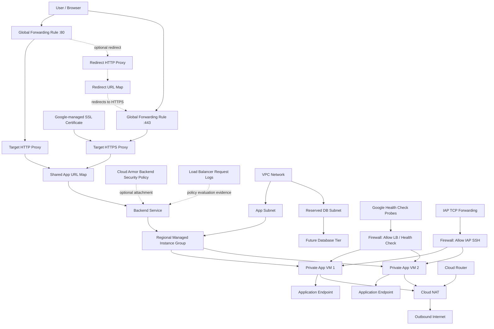

# Architecture — Terraform GCP Production-Lite Web Platform

## 1. Overview

This document explains the architecture of the **Terraform GCP Production-Lite Web Platform**.

The project provisions a small but production-shaped web platform on Google Cloud using Terraform.

The main architectural goal is to demonstrate how an application workload can run behind a load balancer while keeping backend VM instances private.

The architecture includes:

```text
Custom VPC
App subnet
Reserved DB subnet
Map-based firewall rules
Cloud Router
Cloud NAT
Application service account
Regional Managed Instance Group
Instance template
Startup script
HTTP health check
Backend service
External HTTP(S) Load Balancer
Google-managed SSL certificate
Cloud Armor backend security policy
Load balancer request logging
Remote Terraform state
```

This is not a full enterprise landing zone. It is a focused infrastructure artifact designed to prove the core pattern:

```text
private backend instances
+ Managed Instance Group
+ Cloud NAT
+ health checks
+ external HTTP(S) Load Balancer
+ modular Terraform
```

---

## 2. High-Level Architecture

```text
User
  |
  v
External HTTP(S) Load Balancer
  |
  v
Backend Service with optional Cloud Armor policy
  |
  v
Regional Managed Instance Group
  |
  v
Private Application VM(s)
  |
  v
Outbound Internet through Cloud NAT
```

The backend VM instances do not have external IP addresses.

Inbound user traffic enters through the external HTTP(S) Load Balancer. Outbound internet access from the private VM instances is handled through Cloud NAT.

---

## 3. Architecture Diagram



---

## 4. Main Components

| Component                    | Purpose                                                 |
| ---------------------------- | ------------------------------------------------------- |
| VPC                          | Provides the isolated network boundary for the platform |
| App subnet                   | Hosts the application VM instances                      |
| DB subnet                    | Reserved for future database tier                       |
| Firewall rules               | Controls ingress access to backend instances            |
| Cloud Router                 | Required dependency for Cloud NAT                       |
| Cloud NAT                    | Provides outbound internet access for private VMs       |
| Service account              | Runtime identity for application VMs                    |
| Instance template            | Defines how application VMs are created                 |
| Regional MIG                 | Manages the application VM instances                    |
| HTTP health check            | Determines whether backend instances are healthy        |
| Backend service              | Connects load balancer to the MIG                       |
| Cloud Armor policy           | Optionally filters requests at the backend service       |
| Backend request logging      | Captures policy evaluation evidence for review           |
| URL map                      | Routes application traffic to the backend service       |
| Target HTTP proxy            | Receives HTTP traffic from the port 80 forwarding rule  |
| Target HTTPS proxy           | Terminates TLS and sends HTTPS traffic to the URL map   |
| Google-managed SSL cert      | Issues and renews certificates for configured domains   |
| Redirect HTTP proxy          | Optional port 80 proxy used only for HTTPS redirects    |
| Redirect URL map             | Optional redirect-only URL map for HTTP-to-HTTPS        |
| Global forwarding rule :80   | Public HTTP listener                                    |
| Global forwarding rule :443  | Public HTTPS listener                                   |
| Global IP address            | External entry point for users                          |
| GCS backend                  | Stores Terraform remote state                           |

---

## 5. Network Design

The network layer is defined using a custom VPC.

The project uses map-based subnet creation instead of hardcoding subnet resources one by one.

Example subnet structure:

```hcl
subnets = {
  app = {
    cidr_range            = "10.80.1.0/24"
    private_google_access = true
    role                  = "application"
  }

  db = {
    cidr_range            = "10.80.2.0/24"
    private_google_access = true
    role                  = "database-reserved"
  }
}
```

This gives the network module a reusable pattern.

The module does not need to know in advance how many subnets exist. It only needs to receive a structured map and create subnets using `for_each`.

---

## 6. Subnet Roles

### App Subnet

The app subnet is used by the Managed Instance Group.

Application VM instances are deployed into this subnet.

The app subnet receives outbound internet access through Cloud NAT.

### DB Subnet

The DB subnet is created as a reserved private tier.

This version does not provision a database. The DB subnet exists to show tiered network design and prepare the architecture for future database expansion.

In v1.0:

```text
DB subnet exists.
No database is provisioned.
Cloud NAT is not required for the DB subnet by default.
```

---

## 7. Firewall Design

Firewall rules are defined using a map.

This keeps ingress policy data-driven and modular.

Core firewall rules:

```text
allow-lb-health-check
allow-iap-ssh
allow-internal
```

### allow-lb-health-check

Allows Google Cloud load balancer health check and proxy traffic to reach the backend instances.

Typical source ranges:

```text
35.191.0.0/16
130.211.0.0/22
```

Target:

```text
web-backend network tag
```

Port:

```text
80
```

### allow-iap-ssh

Allows SSH access through Identity-Aware Proxy.

Typical source range:

```text
35.235.240.0/20
```

Target:

```text
web-backend network tag
```

Port:

```text
22
```

This avoids opening SSH directly to the internet.

### allow-internal

Allows internal communication inside the platform CIDR range.

Example source range:

```text
10.80.0.0/16
```

This is useful for future internal communication between app, database, cache, or internal services.

---

## 8. Private Backend Design

The application VMs do not have external IP addresses.

In the instance template, the network interface does not include an `access_config` block.

Example:

```hcl
network_interface {
  subnetwork = var.subnetwork_self_link

  # No access_config block.
  # This intentionally creates VMs without external IP addresses.
}
```

This means the backend VMs only receive internal IP addresses.

They cannot be reached directly from the public internet.

User traffic must enter through the external HTTP(S) Load Balancer.

---

## 9. Cloud NAT Design

Private backend VMs still need outbound internet access for operational tasks such as:

```text
apt-get update
package installation
dependency download
external API calls
system patching
```

Because the VMs do not have external IP addresses, outbound internet access is provided through Cloud NAT.

The intended v1.0 design is:

```text
Cloud NAT applies to selected subnets only.
The app subnet receives NAT.
The reserved DB subnet does not receive NAT by default.
```

This is better than giving NAT access to all subnets because it keeps subnet behavior intentional.

---

## 10. Compute Design

The compute layer uses a regional Managed Instance Group.

The MIG is based on an instance template.

The instance template defines:

```text
machine type
boot disk image
network interface
startup script
network tags
service account
```

The MIG defines:

```text
target size
regional placement
named port
autohealing policy
instance template version
```

A MIG is more production-shaped than a standalone VM because it manages a group of instances consistently.

---

## 11. Health Check Design

The application exposes a dedicated health endpoint:

```text
GET /healthz
```

Expected response:

```text
200 OK
ok
```

The health check path is intentionally separate from the root endpoint.

The root endpoint is user-facing:

```text
GET /
```

The health endpoint is operational:

```text
GET /healthz
```

This separation makes backend health easier to reason about.

---

## 12. Load Balancer Design

The external HTTP(S) Load Balancer provides the public entry point.

The load balancer stack includes:

```text
global external IP address
global forwarding rule on port 80
global forwarding rule on port 443 when HTTPS is enabled
target HTTP proxy
target HTTPS proxy when HTTPS is enabled
URL map
backend service
health check
MIG backend
```

The public HTTP listener is port 80.

When HTTPS is enabled, the public HTTPS listener is port 443.

The application URL map and backend service remain shared between HTTP and HTTPS traffic.

---

## 13. HTTPS Architecture

v1.1 adds HTTPS without changing the backend application path.

The HTTPS path is:

```text
User
-> Global forwarding rule on port 443
-> Target HTTPS proxy
-> Shared app URL map
-> Shared backend service
-> Regional MIG
-> Private application VMs
```

The target HTTPS proxy uses a Google-managed SSL certificate.

The certificate domains come from:

```hcl
managed_ssl_certificate_domains = [
  "abrahampn.xyz",
  "www.abrahampn.xyz"
]
```

Google manages certificate issuance and renewal, but certificate activation still depends on public DNS. Each configured domain must resolve to the load balancer global IP address.

For example:

```text
abrahampn.xyz      A     <load-balancer-ip>
www.abrahampn.xyz  A     <load-balancer-ip>
```

HTTPS does not require a separate application backend service.

The shared application routing path is intentionally:

```text
Target HTTP proxy  -> Shared app URL map -> Shared backend service
Target HTTPS proxy -> Shared app URL map -> Shared backend service
```

This keeps HTTP and HTTPS behavior consistent and avoids duplicating routing or backend configuration.

When `enable_http_redirect` is true, Terraform creates a separate redirect URL map and redirect HTTP proxy for port 80. That redirect-only path sends clients to HTTPS and does not replace the shared app URL map used by HTTPS traffic.

The recommended rollout order is:

```text
1. Create the load balancer and global IP.
2. Point DNS records at the global IP.
3. Enable HTTPS and wait for the managed certificate to become active.
4. Enable HTTP-to-HTTPS redirect after HTTPS is working.
```

Terraform also waits briefly after creating the health check before attaching it to GCP resources that consume it. This avoids a Compute API race where the health check exists but is not ready for backend service attachment yet.

---

## 14. Security Hardening Architecture

v1.2 adds a Cloud Armor backend security policy without changing the existing HTTPS frontend or application routing path.

```text
User request
-> Existing HTTP(S) frontend and URL map
-> Shared backend service with Cloud Armor policy attached
-> Existing regional MIG
-> Private application VMs
```

The policy is attached to the existing backend service. No additional URL map, target HTTPS proxy, forwarding rule, or MIG is required.

The initial rollout configuration uses:

```text
default allow rule at priority 2147483647
custom deny or WAF rules with explicit priorities
preview mode for newly introduced WAF rules
backend request logging enabled during policy observation
```

Cloud Armor logs are emitted through load balancer request logging. Keeping full sampling during the preview window allows denied and preview matches to be inspected before enforcement decisions are made.

---

## 15. Runtime Application

The application is intentionally simple.

It exposes:

| Endpoint    | Purpose               |
| ----------- | --------------------- |
| `/`         | Root response         |
| `/healthz`  | Health check response |
| `/metadata` | Runtime information   |

Example root response:

```text
Hi from Terraform GCP Production-Lite Platform
```

Example health response:

```text
ok
```

Example metadata response:

```json
{
  "service": "terraform-gcp-production-lite-web-platform",
  "environment": "dev",
  "version": "1.0.0",
  "hostname": "dev-web-mig-xxxx"
}
```

The application is not the main focus. The infrastructure pattern is the focus.

---

## 16. IAM Design

The application VM instances use a dedicated service account.

The service account should follow least privilege.

Recommended roles for v1.0:

```text
roles/logging.logWriter
roles/monitoring.metricWriter
```

Avoid broad roles such as:

```text
roles/editor
roles/owner
```

The admin principal may also need these roles for IAP and OS Login workflows:

```text
roles/iap.tunnelResourceAccessor
roles/compute.osAdminLogin
roles/iam.serviceAccountUser
```

---

## 17. Remote State Design

Terraform state is stored in Google Cloud Storage.

The backend should use a separate prefix for this artifact.

Example:

```hcl
terraform {
  backend "gcs" {
    bucket = "YOUR_TERRAFORM_STATE_BUCKET"
    prefix = "terraform-gcp-production-lite-web-platform/v1"
  }
}
```

The state bucket should already exist before this project is initialized.

The backend file is usually created locally from:

```bash
cp backend.tf.example backend.tf
```

---

## 18. Current Scope

Current v1.2 Terraform scope includes:

```text
HTTP and HTTPS entry points
Google-managed SSL certificate
custom domain support
optional HTTP-to-HTTPS redirect
optional Cloud Armor backend security policy
backend request logging configuration
private backend VMs
MIG
Cloud NAT
health checks
load balancer
firewall rules
remote state
modular Terraform
```

Current v1.2 scope does not include:

```text
Cloud SQL
Secret Manager
CI/CD
Kubernetes
multi-region production deployment
```

Those features are deferred to later versions.

---

## 19. Architecture Roadmap

### v1.1 — HTTPS and Custom Domain

Included additions:

```text
Google-managed SSL certificate
custom domain
HTTPS target proxy
global forwarding rule on port 443
optional HTTP-to-HTTPS redirect
```

### v1.2 — Security Hardening

Implemented in Terraform; deployment requires a reviewed plan and verification:

```text
Cloud Armor backend security policy
backend service policy attachment
load balancer request logging
policy rollout and verification documentation
```

### v2.0 — Terraform CI/CD

Planned additions:

```text
GitHub Actions
plan on pull request
manual apply approval
Workload Identity Federation
no service account key
```

### v3.0 — Database and Secrets

Planned additions:

```text
Cloud SQL private IP
Secret Manager
private service access
application configuration loading
```

---

## 20. Architecture Summary

This platform demonstrates the following design principle:

```text
Application backends should not be directly exposed to the internet.
Traffic should enter through a controlled entry point.
TLS should terminate at the load balancer edge.
Private workloads should use NAT for outbound access.
Infrastructure should be reproducible through Terraform.
```

The key pattern is:

```text
External HTTP(S) Load Balancer
-> Shared URL Map
-> Shared Backend Service
-> Regional MIG
-> Private App VMs
-> Cloud NAT for outbound access
```

This is the core production-lite web platform pattern for v1.1.
